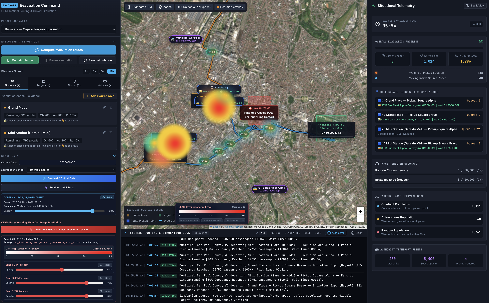

# EVAC-OPS — Evacuation Management, Tactical Routing & Space Data Simulation Application

An interactive emergency management User Interface (UI) built on OpenStreetMap (OSM) for coordinating urban evacuations, computing strict obstacle-avoiding evacuation routes, running animated crowd/vehicle density heatmap simulations, and integrating live **Google Earth Engine (Sentinel-2 Optical & Sentinel-1 SAR)** and **Copernicus CEMS GloFAS Early Warning River Discharge** layers.

For full functional and technical specifications, see **[spec.md](./spec.md)**.



---

## Table of Contents

1. [System Prerequisites](#1-system-prerequisites)
2. [Python Conda Environment Setup](#2-python-conda-environment-setup)
3. [Google Earth Engine (GEE) Authentication & GCP Project Setup](#3-google-earth-engine-gee-authentication--gcp-project-setup)
4. [Copernicus CEMS / EWDS Account & `~/.cdsapirc` Configuration](#4-copernicus-cems--ewds-account--cdsapirc-configuration)
5. [Running the Application](#5-running-the-application)
6. [Testing Server-Side Space Data & Hydrological Scripts Directly](#6-testing-server-side-space-data--hydrological-scripts-directly)
7. [Key Features Overview](#7-key-features-overview)

---

## 1. System Prerequisites

To run the complete EVAC-OPS web application (including server-side Google Earth Engine satellite composites and CEMS GloFAS hydrological forecasts), ensure the host machine has:

- **Node.js 18+** and **npm 9+**
- **Conda / Miniconda / Mamba** (Python 3.10+ environment with GDAL / `rasterio` / `cfgrib` / `eccodes` support)
- **Google Cloud Platform (GCP) Project** enabled for the **Google Earth Engine API**
- **Copernicus Early Warning Data Store (EWDS) Account** with API key configured in `~/.cdsapirc`

---

## 2. Python Conda Environment Setup

The backend server middleware ([`vite.config.ts`](./vite.config.ts)) invokes server-side Python scripts for:
- **Sentinel-2 Optical True-Color Composite (`COPERNICUS/S2_SR_HARMONIZED`)**: [`server/ee_sentinel2.py`](./server/ee_sentinel2.py)
- **Sentinel-1 SAR False-Color Composite (`COPERNICUS/S1_GRD`, bands `VV`, `VH`, `VV/VH`)**: [`server/ee_sentinel1.py`](./server/ee_sentinel1.py)
- **CEMS GloFAS 24h / 48h / 72h River Discharge Forecast (`cems-glofas-forecast`)**: [`scripts/download_glofas.py`](./scripts/download_glofas.py)

### Create & Populate the `evacs` Conda Environment

```bash
# 1. Create the conda environment with compiled geospatial/GRIB2 libraries from conda-forge
conda create -n evacs -c conda-forge python=3.11 \
  rasterio rioxarray xarray cfgrib eccodes numpy pyproj -y

# 2. Activate the environment
conda activate evacs

# 3. Install Google Earth Engine API and Copernicus CDS API client
pip install earthengine-api cdsapi
```

> **Note on Python Binary Path**:
> By default, [`vite.config.ts`](./vite.config.ts) looks for `/opt/conda/envs/evacs/bin/python`.
> If your `evacs` Conda environment is located elsewhere (e.g., `~/miniconda3/envs/evacs/bin/python`), set the `EE_PYTHON` environment variable before starting the server:
> ```bash
> export EE_PYTHON="$(conda run -n evacs which python)"
> ```

---

## 3. Google Earth Engine (GEE) Authentication & GCP Project Setup

The **Space Data** panel executes server-side Python scripts ([`server/ee_sentinel2.py`](./server/ee_sentinel2.py) and [`server/ee_sentinel1.py`](./server/ee_sentinel1.py)) that authenticate and initialize Earth Engine using:

```python
ee.Authenticate()
ee.Initialize(project='geo-stars')
```

Follow the steps below to configure your Google Cloud Platform (GCP) project and authenticate via the `earthengine` CLI before starting the server process.

### Step 3.1 — Configure Your Google Cloud Platform (GCP) Project

1. **Create or select a GCP Project** in the [Google Cloud Console](https://console.cloud.google.com/) (default configured project ID: `geo-stars`).
2. **Enable the Earth Engine API** on your GCP project:
   ```bash
   gcloud services enable earthengine.googleapis.com --project=geo-stars
   ```
3. **Register the GCP Project with Earth Engine** at:
   [https://code.earthengine.google.com/register](https://code.earthengine.google.com/register)
4. **Verify IAM Roles**: Ensure your Google account (or service account) has at least:
   - `Earth Engine Resource Viewer` (`roles/earthengine.viewer`) or `Earth Engine Resource Writer` (`roles/earthengine.writer`)
   - `Service Usage Consumer` (`roles/serviceusage.serviceUsageConsumer`)

*(If you use a different GCP project ID than `geo-stars`, update `ee.Initialize(project='YOUR_PROJECT_ID')` in [`server/ee_sentinel2.py`](./server/ee_sentinel2.py) and [`server/ee_sentinel1.py`](./server/ee_sentinel1.py).)*

### Step 3.2 — Authenticate on the Server Using the `earthengine` CLI

Run the `earthengine` CLI from the `evacs` Python environment on the server **once** before starting the web server process so persistent credentials are stored under `~/.config/earthengine/credentials`:

#### Option A — Local Workstation with Browser Access
```bash
/opt/conda/envs/evacs/bin/earthengine authenticate
```

#### Option B — Remote / Headless SSH Server (No Local Browser)
Use notebook authentication mode to generate a URL you can open in any browser and paste back the authorization code:
```bash
/opt/conda/envs/evacs/bin/earthengine authenticate --auth_mode=notebook
```

### Step 3.3 — Verify Earth Engine Authentication & Project Initialization

Confirm that `ee.Authenticate()` and `ee.Initialize(project='geo-stars')` succeed without interactive prompts:

```bash
/opt/conda/envs/evacs/bin/python -c "
import ee
ee.Authenticate()
ee.Initialize(project='geo-stars')
print('Earth Engine authenticated and initialized successfully!')
"
```

---

## 4. Copernicus CEMS / EWDS Account & `~/.cdsapirc` Configuration

The **CEMS Early Warning River Discharge Prediction** section downloads operational GloFAS (`cems-glofas-forecast`, v3.1 LISFLOOD control forecast) 24h, 48h, and 72h river discharge forecasts via the **Copernicus Early Warning Data Store (EWDS)** API (`cdsapi`).

### Step 4.1 — Create an EWDS Account & Accept the Dataset License

1. **Register or Sign In** at the Copernicus Early Warning Data Store (EWDS):
   [https://ewds.climate.copernicus.eu/](https://ewds.climate.copernicus.eu/)
2. **Accept the Dataset Terms of Use** *(Mandatory)*:
   - Open [https://ewds.climate.copernicus.eu/datasets/cems-glofas-forecast?tab=download](https://ewds.climate.copernicus.eu/datasets/cems-glofas-forecast?tab=download)
   - Scroll to the **Terms of use** section at the bottom of the download form and click **Accept** while logged in. *(API requests will fail with `403 Forbidden` until the license is accepted on your account.)*
3. **Retrieve Your Personal Access Token**:
   - Visit your user profile page: [https://ewds.climate.copernicus.eu/profile](https://ewds.climate.copernicus.eu/profile)
   - Copy your **Personal Access Token** under the **API Token** section.

### Step 4.2 — Configure `~/.cdsapirc` on the Server

Create or update `~/.cdsapirc` in the home directory of the user running the server process:

```bash
cat << 'EOF' > ~/.cdsapirc
url: https://ewds.climate.copernicus.eu/api
key: YOUR_PERSONAL_ACCESS_TOKEN_HERE
EOF

chmod 600 ~/.cdsapirc
```

### Step 4.3 — How `tmp_downloads/` Caching & Cleanup Work

- All downloaded GRIB2 files and converted 3-band GeoTIFF files (`24h`, `48h`, `72h` lead times) are stored in the temporary folder `./tmp_downloads/`.
- **Automatic Cleanup**: Whenever the application starts up (`/api/cems-glofas/cleanup`) or whenever a download is requested, every file in `./tmp_downloads/` from previous days (not matching today's date `YYYY-MM-DD`) is automatically deleted.
- **Same-Day Cache Reuse**: If a GeoTIFF file for today and the requested 100 km region (`glofas_forecast_YYYY-MM-DD_<lat>_<lon>.tif`) already exists in `./tmp_downloads/`, it is reused immediately without re-downloading from EWDS to spare download time.

---

## 5. Running the Application

### 1. Install Frontend & Server Dependencies
```bash
npm install
```

### 2. Start the Development Server
```bash
npm run dev -- --host 0.0.0.0 --port 8080
```
Open `http://localhost:8080` in your browser.

### 3. Production Build & Preview Server
```bash
npm run build
npm run preview -- --host 0.0.0.0 --port 8080
```

---

## 6. Testing Server-Side Space Data & Hydrological Scripts Directly

You can test each server-side Python script directly from the terminal to verify credentials and data generation:

```bash
# 1. Test Sentinel-2 Optical RGB Median Composite (lng, lat, start_date, end_date)
/opt/conda/envs/evacs/bin/python server/ee_sentinel2.py 4.3517 50.8503 2026-08-20 2026-09-20

# 2. Test Sentinel-1 SAR False-Color Composite (VV, VH, VV/VH)
/opt/conda/envs/evacs/bin/python server/ee_sentinel1.py 4.3517 50.8503 2026-08-20 2026-09-20

# 3. Test CEMS GloFAS 24h / 48h / 72h River Discharge Forecast (100 km radius around Brussels)
/opt/conda/envs/evacs/bin/python scripts/download_glofas.py \
  --lat 50.8503 --lon 4.3517 --radius 100000 --json
```

---

## 7. Key Features Overview

- **4-Panel Tactical Cockpit Layout**:
  - **Left Control Panel (`25% Width × 100% Height`)**: Scenario selector (`Brussels`, `Paris`, `Custom`), collapsible **Execution & Simulation** panel (`Compute evacuation routes`, `Run simulation`, `Pause simulation`, `Reset simulation`, speed multiplier), CRUD management for Source Areas, Target Shelters, No-Go Zones, and Vehicle Fleets, and collapsible **Space Data** panel.
  - **Center Map Viewport (`50% Width × 75% Height`)**: Zero-API-key OpenStreetMap base layers (`Standard OSM`, `Humanitarian OSM`, `CyclOSM`), interactive polygon drawing & vehicle staging depot placement, **Blue Square Pickup Locations**, strict No-Go-avoiding directional evacuation corridors, 60 FPS HTML5 Canvas thermal density heatmap overlay, **Sentinel-2 Optical RGB** & **Sentinel-1 SAR (`VV`, `VH`, `VV/VH`)** Earth Engine layers, and **CEMS GloFAS 24h / 48h / 72h River Discharge** overlays with White (`0`) &rarr; Red (`80`, clipped at 80) color map legend.
  - **Bottom Console Panel (`50% Width × 25% Height`)**: Real-time system, routing, simulation, Earth Engine, and CEMS GloFAS log stream with level filtering.
  - **Right Situational Telemetry Panel (`25% Width × 100% Height`)**: Exact population conservation KPIs (`Safe at Shelter`, `On Vehicles`, `In Source Area`), elapsed simulation clock (`MM:SS`), Target Shelter occupancy bars, and behavioral breakdowns (`Obedient`, `Autonomous`, `Random`).
